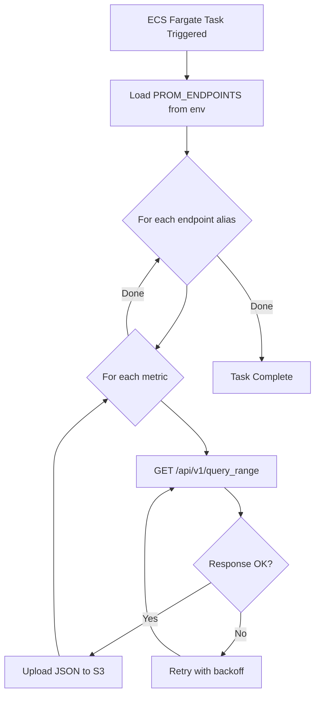

# Kubernetes Metrics Scraper (Prometheus ➜ S3)

Containerized scraper that queries Prometheus `query_range` for a fixed list of Kubernetes metrics and uploads raw JSON responses to S3, partitioned by endpoint alias and hour.

---

## ✅ What it does

- Reads **PROM_ENDPOINTS** (JSON object) from environment (required)
- For each endpoint alias and each metric in `METRICS`:
  - Calls Prometheus `query_range` for a 1-hour UTC window
  - Step size = **3600s**
  - Uploads response as `application/json` to:
    - `s3://<S3_BUCKET>/<BASE_S3_PATH>/<alias>/YYYY_MM_DD/HH/<metric>.json`
- Backfills the last **HOURS_TO_BACKFILL** hours (default: 8)
- Retries failures with exponential backoff (default: 3 attempts)

---

## 🧩 Architecture


---

## ⚙️ Configuration

### Static config (in code)

These are currently hardcoded in the script:

| Constant                | Value                          |
|-------------------------|--------------------------------|
| `AWS_REGION`            | `us-east-1`                    |
| `S3_BUCKET`             | `k8s-exported-metrics-opslyft` |
| `BASE_S3_PATH`          | `k8s_data`                     |
| `HOURS_TO_BACKFILL`     | `8`                            |
| `STEP_SECONDS`          | `3600`                         |
| `TIMEOUT_SECONDS`       | `30`                           |
| `MAX_RETRIES`           | `3`                            |
| `RETRY_BACKOFF_SECONDS` | `2`                            |

### Required env var

**PROM_ENDPOINTS** (required)  
Must be a JSON object mapping alias ➜ Prometheus query_range URL.
```bash
export PROM_ENDPOINTS='{
  "prod": "https://prom.example.com/api/v1/query_range",
  "stg": "https://prom-stg.example.com/api/v1/query_range"
}'
```

---

## 📦 Output layout in S3

Each metric becomes one file per hour per endpoint alias:
```
s3://k8s-exported-metrics-opslyft/
  k8s_data/
    prod/
      2026_01_19/
        13/
          kube_node_info.json
          kube_pod_info.json
          container_cpu_usage_seconds_total.json
          ...
    stg/
      2026_01_19/
        13/
          kube_node_info.json
          ...
```

**S3 key template:**
```
{BASE_S3_PATH}/{alias}/{YYYY_MM_DD}/{HH}/{metric}.json
```

---

## ▶️ Run locally

### 1) Install dependencies
```bash
uv sync
```

### 2) Export environment variables
```bash
export PROM_ENDPOINTS=export PROM_ENDPOINTS='{
  "prod": "http://{your_host_name_here:port_if_needed}/api/v1/query_range",
  "stg": "http://{your_host_name_here:port_if_needed}/api/v1/query_range"
}'
```

### 3) Run
```bash
uv run python scraper.py
```